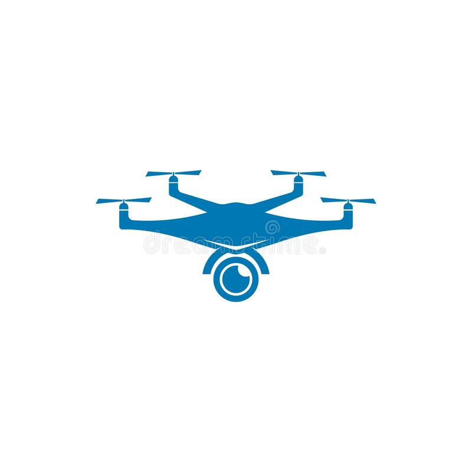
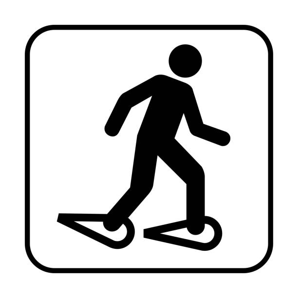

<!DOCTYPE html>
<html lang="en">
<head>
    <meta charset="UTF-8">
    <meta name="viewport" content="width=device-width, initial-scale=1.0">
    <title>Mon CV</title>
    <link rel="stylesheet" href="Styles/cvresp.css">
</head>

<body>
    <button id="retourEnHaut" onclick="retourEnHaut()">Retour en haut</button>
    <nav class="navbar">
        

            <h1>Mon Curriculum Vitae</h1>
        

        <input type="checkbox" id="navbar-toggle">
        <label for="navbar-toggle" class="navbar-toggle-label">&#9776;</label>
        

            <a href="#about">À propos</a>
            <a href="#experience">Expérience</a>
            <a href="#education">Formation</a>
            <a href="#skills">Compétences</a>
            <a href="https://www.linkedin.com/in/jean-paul-persiani-66021792/">LinkedIn</a>                    
        

    </nav>
    

        

            

                
            

            

                <h1 id="jpp">Jean-Paul PERSIANI</h1>
                <li class="li"><strong>Développeur Front-End</strong></li>
            

        

        

            

            <ul>
                <h2>Informations Personnelles</h2>
                <li>Habite à Port-de-Bouc</li>
                <li>Reconnaissance : <mark><strong>travailleur handicapé</strong></mark></li>
                <li>61 ans</li>
                <li>Délégué Syndical CGT</li>
                <li>Email : <strong><a href="mailto:jp.persiani@gmail.com">jp.persiani@gmail.com</a></strong></li>
                <li>Portable : <strong>06.13.07.17.76</strong></li> 
            </ul>
            

            

                <h2>Expérience professionnelle</h2>
                

                    <h3>ETUDES INFORMATIQUE Marseille</h3>
                    <li class="li">Analyste-Programmeur Cobol/li>
                    <li class="nli">De mars 1983 à septembre 1985</li>
                

                

                    <h3>MIDI OXYGENE Marseille</h3>
                    <li class="li">Analyste-Programmeur Gap II</li>
                    <li class="nli">D'octobre 1985 à mai 1988</li>
                

                

                    <h3>JET SERVICES Nice & Toulon</h3>
                    <li class="li">Correspondant Informatique</li>
                    <li class="nli">De juin 1988 à mars 1998</li>
                

                

                    <h3>TNT Lyon</h3>
                    <li class="li">Responsable Régional Informatique</li>
                    <li class="nli">D'avril 1998 à octobre 2003</li>
                

                

                    <h3>PHIMACOM Marseille</h3>
                    <li class="li">Technico-Commercial</li>
                    <li class="nli">De février 2004 à novembre 2009</li>
                

                

                    <h3>SITTI Aix-en-Provence</h3>
                    <li class="li">Conseiller en Communication Digitale</li>
                    <li class="nli">De novembre 2010 à juin 2021</li>
                

            

            

                <h2>Formation</h2>
                

                    <h3>Lycée Jean Lurçat Martigues</h3>
                    <li class="li">Baccalauréat F1</li>
                    <li class="nli">Juin 1981</li>
                

                

                    <h3>Institut privé CONTROL-DATA Marseille</h3>
                    <li class="li">Diplôme d’analyste-programmeur</li>
                    <li class="nli">De septembre 1981 à avril 1982</li>
                
               
                

                    <h3>CNAM Nice</h3>
                    <li class="li">DUT Informatique d'entreprise</li>
                    <li class="nli">De septembre 1983 à juin 1985</li>
                

                

                    <h3>Université Marseille 2</h3>
                    <li class="li">DESS d'aide à la décision & NTIC</li>
                    <li class="nli">De septembre 1996 à juin 1997</li>
                

            

            

                <h2>Compétences Techniques</h2>
                

                    
                    
                    
                    
                         
                
           
                <h2>Autres Compétences</h2>
                

                    
                    
                    
                    
                         
                       
                       
                
          
            

        

    

    
</body>
</html>
